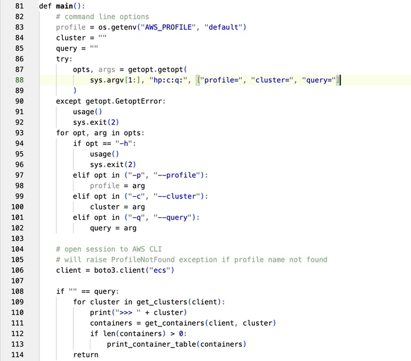

# Blue Heron Lite
## VSCode Theme

"Blue Heron Lite" is a light theme for Visual Studio Code using a minimal color scheme.  This theme aims to provide a clean and elegant look for your coding environment with very few colors...  mostly black text on a white background.  Strings are blue.  Comments are a faded gray-green color.

## Why this Theme?

Remember the early days of computing? When dark mode was the default, and our terminals glowed with amber or green text on a black background? Those were simpler times.

As technology evolved, we embraced color monitors. Suddenly, we had black text on a white background, analogous to reading a book. Syntax highlighting was minimal, and our IDEs displayed code that was easy on the eyes.

But somewhere along the way, we went overboard. Daytime dark mode became a thing, and our IDEs exploded in a kaleidoscope of colors. Magenta and orange text that wasn't a syntax error? Cyan so bright it could blind you? It was too much. We lost the simplicity and clarity that made coding enjoyable.

This theme is a return to our roots. It's designed to provide a clean, distraction-free coding environment. No excessive colors -- just a straightforward, readable color scheme that keeps your focus where it belongs -- on the code.

## Features

- Minimalist
- Very few colors
- Very few bold fonts

## Preview



## Development

### First time setup

Install VSCode Extension Manager (first time only)

```sh
npm install -g vsce
```

### Testing locally

After making changes to a theme, you need to regenerate the `vsix` file:

```sh
vsce package
```

## License

[MIT](LICENSE.md)

## Attribution

The JSON content used in this theme was based on the "Delphi Default" theme by alefragnani:

* <https://github.com/alefragnani/vscode-delphi-themes/>
